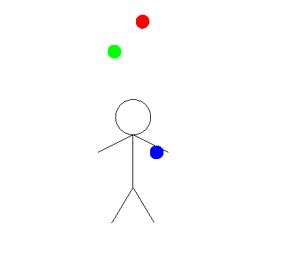

# Juggling simulation with Gloss

This is reimplementation of [Juggling in Haskell and Gloss](https://cdsmith.wordpress.com/2012/02/14/juggling-in-haskell-and-gloss/)

The link to simulation server on that page is dead, I try to rebuild with some guessing on type and missing gloss functions added.

Most of code belong to original author `cdsmith`, the derived work is [unlicense](https://unlicense.org/)


## Know bug

- On many rendered frames, ball count exceed 3 and ball index swapped

## Room for improvements

- change pattern without need to recompiling
- better data modeling
- balls have unique id

## Running

```
$ nix-shell --run 'cabal new-run`
```


